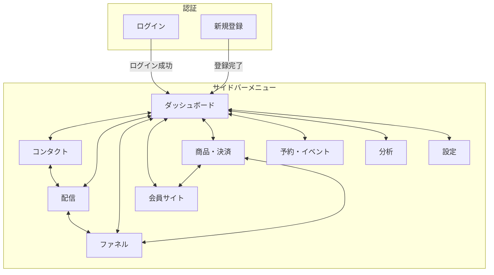
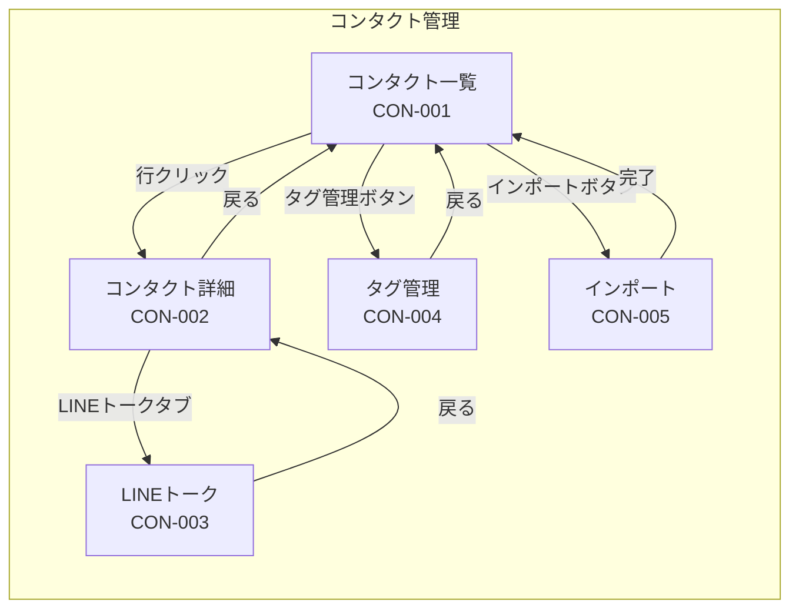
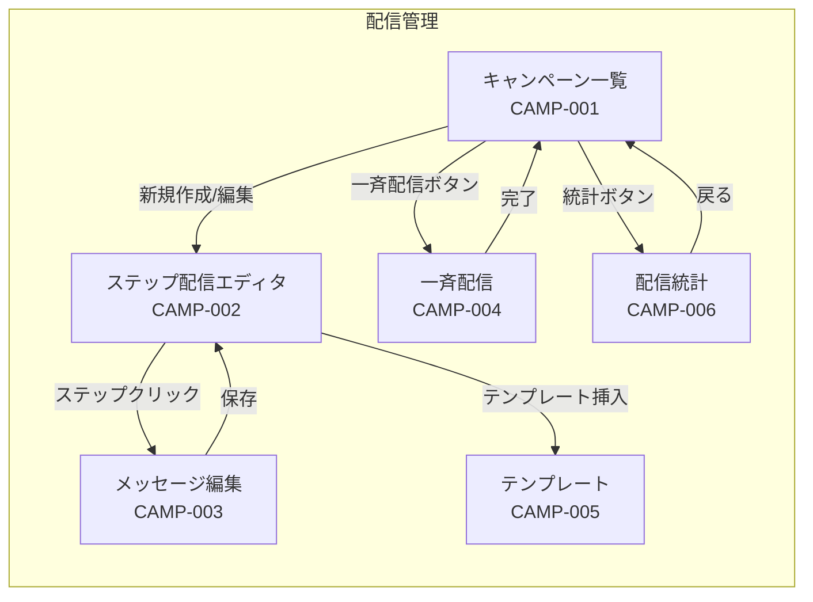
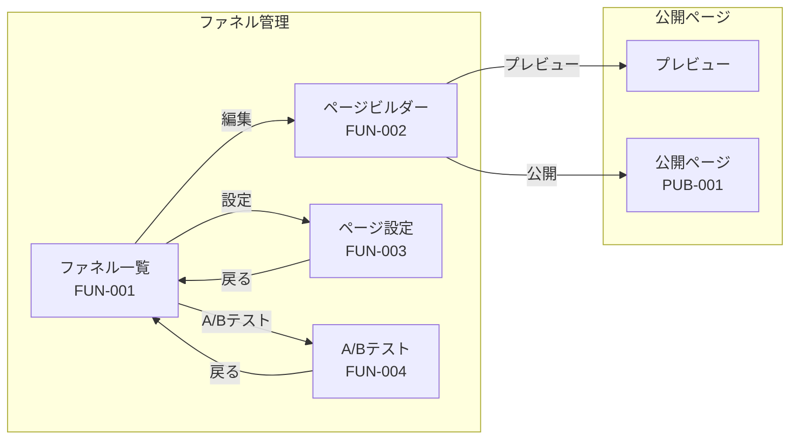
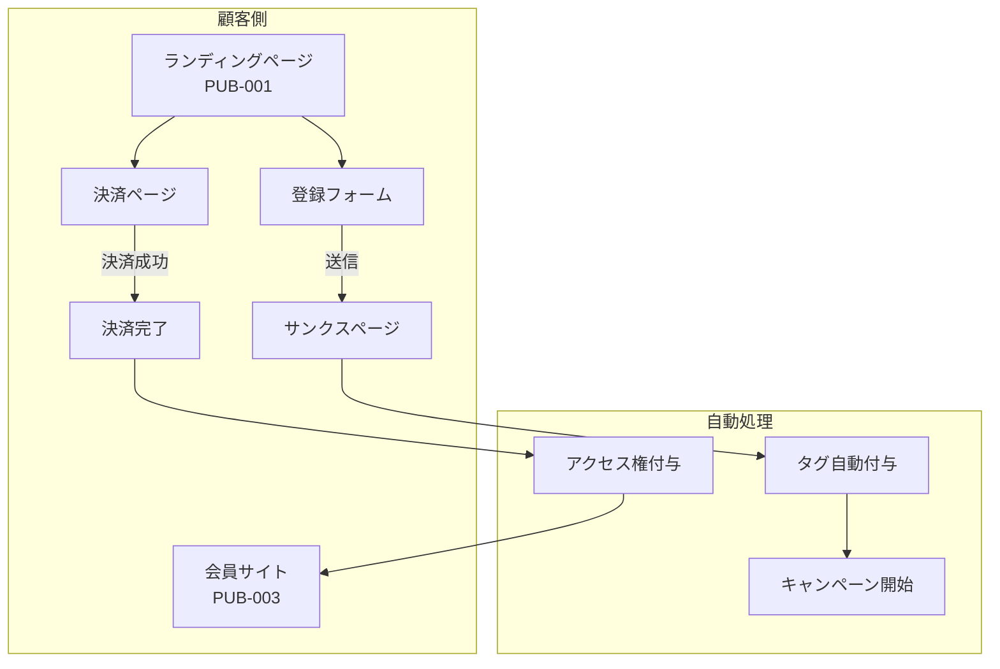
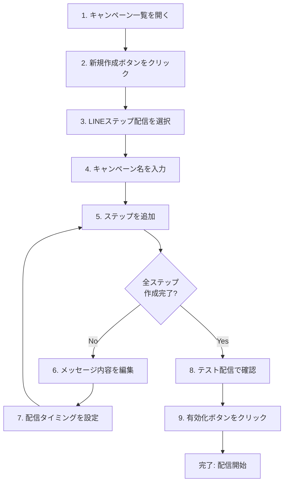
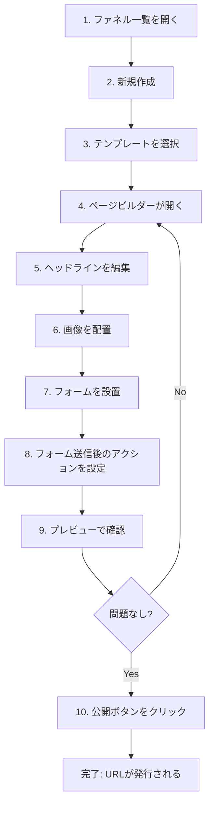
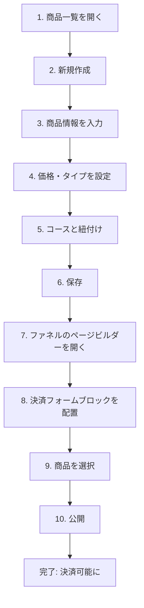
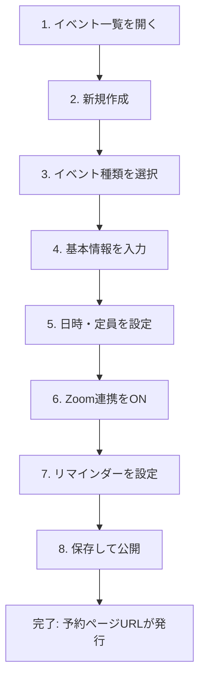
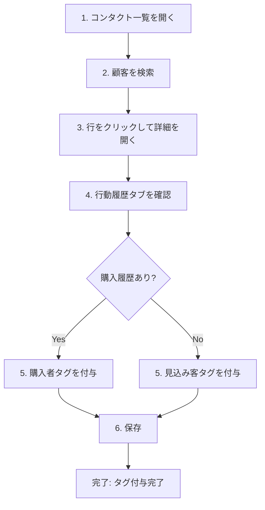

# 画面遷移・情報設計書

## 本ドキュメントの読み方

このドキュメントは、システムの画面構成と操作の流れを説明します。

| セクション | 内容 | こんな時に読む |
|-----------|------|---------------|
| 1. サイトマップ | 全画面の階層構造 | 全体像を把握したい |
| 2. 画面一覧 | 各画面の詳細説明 | 特定の画面について知りたい |
| 3. 画面遷移図 | 画面間の移動関係 | どこからどこへ行けるか確認したい |
| 4. ユーザーフロー | 具体的な操作手順 | 実際の使い方を知りたい |
| 5. 用語集 | 専門用語の説明 | 言葉の意味が分からない |

---

## 1. サイトマップ（全体構造）

```
MarketingHub（統合マーケティング自動化システム）
│
├── 認証エリア（ログイン前）
│   ├── ログイン
│   ├── 新規登録
│   ├── パスワード再設定
│   └── 公開ページ
│        ├── ファネルページ（LP・サンクスページ）
│        ├── 予約ページ
│        └── 配信停止ページ
│
└── 管理画面（ログイン後）
    │
    ├── ダッシュボード ← ログイン後の最初の画面
    │
    ├── コンタクト管理
    │   ├── コンタクト一覧
    │   ├── コンタクト詳細
    │   │   ├── 基本情報
    │   │   ├── タグ管理
    │   │   ├── 行動履歴
    │   │   └── LINEトーク
    │   ├── タグ管理
    │   └── インポート/エクスポート
    │
    ├── 配信管理
    │   ├── キャンペーン一覧
    │   ├── ステップ配信エディタ
    │   │   ├── ステップ設定
    │   │   ├── 条件分岐設定
    │   │   └── メッセージ編集
    │   ├── 一斉配信
    │   ├── テンプレート管理
    │   └── 配信履歴・統計
    │
    ├── ファネル管理
    │   ├── ファネル一覧
    │   ├── ページビルダー
    │   │   ├── ブロック編集
    │   │   ├── フォーム設定
    │   │   └── アクション設定
    │   └── A/Bテスト
    │
    ├── 会員サイト
    │   ├── コース一覧
    │   ├── コース編集
    │   │   ├── 基本設定
    │   │   └── レッスン管理
    │   └── 受講者管理
    │
    ├── 決済・商品
    │   ├── 商品一覧
    │   ├── 商品編集
    │   ├── 注文一覧
    │   └── サブスクリプション管理
    │
    ├── 予約・イベント
    │   ├── イベント一覧
    │   ├── イベント編集
    │   ├── 予約一覧
    │   └── カレンダー表示
    │
    ├── 分析・レポート
    │   ├── ダッシュボード（分析）
    │   ├── ファネル分析
    │   ├── 配信効果分析
    │   └── 売上レポート
    │
    └── 設定
        ├── アカウント設定
        ├── チーム・権限
        ├── LINE連携
        ├── メール設定
        ├── 決済設定
        └── ドメイン設定
```

---

## 2. 画面一覧

### 2.1 認証エリア

| 画面ID | 画面名 | パス | 説明 | 主な機能 |
|--------|--------|------|------|----------|
| AUTH-001 | ログイン | /login | システムへのログイン | メール/パスワード入力、ソーシャルログイン |
| AUTH-002 | 新規登録 | /signup | 新規アカウント作成 | アカウント情報入力、利用規約同意 |
| AUTH-003 | パスワード再設定 | /reset-password | パスワードのリセット | メール送信、新パスワード設定 |

### 2.2 公開ページ（ログイン不要）

| 画面ID | 画面名 | パス | 説明 | 主な機能 |
|--------|--------|------|------|----------|
| PUB-001 | ファネルページ | /p/[slug] | LP・サンクスページ等 | コンテンツ表示、フォーム、決済 |
| PUB-002 | 予約ページ | /r/[slug] | 予約受付ページ | カレンダー表示、予約フォーム |
| PUB-003 | 会員サイト | /m/[slug] | オンラインコース視聴 | 動画視聴、進捗管理 |
| PUB-004 | 配信停止 | /unsubscribe/[token] | メール配信停止 | 配信停止処理、理由選択 |

### 2.3 ダッシュボード

| 画面ID | 画面名 | パス | 説明 | 主な機能 |
|--------|--------|------|------|----------|
| DASH-001 | ダッシュボード | /dashboard | メイン画面 | KPI表示、最近のアクティビティ、クイックアクション |

### 2.4 コンタクト管理

| 画面ID | 画面名 | パス | 説明 | 主な機能 |
|--------|--------|------|------|----------|
| CON-001 | コンタクト一覧 | /contacts | 顧客リスト表示 | 検索、フィルター、ソート、エクスポート |
| CON-002 | コンタクト詳細 | /contacts/[id] | 個別顧客情報 | 情報編集、タグ管理、履歴表示 |
| CON-003 | LINEトーク | /contacts/[id]/chat | 1対1チャット | メッセージ送受信、テンプレート |
| CON-004 | タグ管理 | /tags | タグの管理 | 作成、編集、削除、一括操作 |
| CON-005 | インポート | /contacts/import | CSV取り込み | ファイルアップロード、マッピング |

### 2.5 配信管理

| 画面ID | 画面名 | パス | 説明 | 主な機能 |
|--------|--------|------|------|----------|
| CAMP-001 | キャンペーン一覧 | /campaigns | 配信一覧 | 一覧表示、ステータス管理、新規作成 |
| CAMP-002 | ステップ配信エディタ | /campaigns/[id] | シナリオ作成 | ステップ追加、条件分岐、タイミング設定 |
| CAMP-003 | メッセージ編集 | /campaigns/[id]/steps/[stepId] | 配信内容編集 | テキスト編集、変数挿入、プレビュー |
| CAMP-004 | 一斉配信 | /broadcasts/new | 一括配信作成 | セグメント選択、即時/予約配信 |
| CAMP-005 | テンプレート管理 | /templates | 定型文管理 | 作成、編集、カテゴリ分類 |
| CAMP-006 | 配信統計 | /campaigns/[id]/stats | 効果測定 | 開封率、クリック率、グラフ表示 |

### 2.6 ファネル管理

| 画面ID | 画面名 | パス | 説明 | 主な機能 |
|--------|--------|------|------|----------|
| FUN-001 | ファネル一覧 | /funnels | ファネルリスト | 一覧表示、新規作成、公開/非公開 |
| FUN-002 | ページビルダー | /funnels/[id]/builder | ページ編集 | ドラッグ&ドロップ、ブロック追加、プレビュー |
| FUN-003 | ページ設定 | /funnels/[id]/settings | ページ設定 | SEO、OGP、ドメイン設定 |
| FUN-004 | A/Bテスト | /funnels/[id]/ab-test | テスト設定 | バリアント作成、トラフィック配分、結果表示 |

### 2.7 会員サイト

| 画面ID | 画面名 | パス | 説明 | 主な機能 |
|--------|--------|------|------|----------|
| MEM-001 | コース一覧 | /courses | コースリスト | 一覧表示、新規作成 |
| MEM-002 | コース編集 | /courses/[id] | コース設定 | 基本情報、サムネイル、公開設定 |
| MEM-003 | レッスン管理 | /courses/[id]/lessons | レッスン編集 | 並び替え、動画アップロード、公開日設定 |
| MEM-004 | 受講者一覧 | /courses/[id]/members | 受講者管理 | 進捗確認、アクセス権管理 |

### 2.8 決済・商品

| 画面ID | 画面名 | パス | 説明 | 主な機能 |
|--------|--------|------|------|----------|
| PAY-001 | 商品一覧 | /products | 商品リスト | 一覧表示、新規作成 |
| PAY-002 | 商品編集 | /products/[id] | 商品設定 | 価格、タイプ（単発/サブスク）、コース紐付け |
| PAY-003 | 注文一覧 | /orders | 売上管理 | 注文検索、返金処理、領収書発行 |
| PAY-004 | 注文詳細 | /orders/[id] | 注文詳細 | 注文内容、顧客情報、返金 |
| PAY-005 | サブスク管理 | /subscriptions | 継続課金管理 | 一覧、解約処理 |

### 2.9 予約・イベント

| 画面ID | 画面名 | パス | 説明 | 主な機能 |
|--------|--------|------|------|----------|
| EVT-001 | イベント一覧 | /events | イベントリスト | 一覧表示、新規作成 |
| EVT-002 | イベント編集 | /events/[id] | イベント設定 | 日時、定員、Zoom連携 |
| EVT-003 | 予約一覧 | /events/[id]/reservations | 予約管理 | 予約者一覧、キャンセル処理 |
| EVT-004 | カレンダー | /calendar | カレンダー表示 | 月/週/日表示、予定確認 |

### 2.10 分析・レポート

| 画面ID | 画面名 | パス | 説明 | 主な機能 |
|--------|--------|------|------|----------|
| ANL-001 | 分析ダッシュボード | /analytics | 分析概要 | KPI推移、期間選択 |
| ANL-002 | ファネル分析 | /analytics/funnels | ファネル効果 | 段階別離脱率、CV率 |
| ANL-003 | 配信分析 | /analytics/campaigns | 配信効果 | 開封率推移、クリック率 |
| ANL-004 | 売上レポート | /analytics/revenue | 売上分析 | 日別/月別売上、商品別 |

### 2.11 設定

| 画面ID | 画面名 | パス | 説明 | 主な機能 |
|--------|--------|------|------|----------|
| SET-001 | アカウント設定 | /settings | 基本設定 | プロフィール、パスワード変更 |
| SET-002 | チーム・権限 | /settings/team | メンバー管理 | 招待、権限設定 |
| SET-003 | LINE連携 | /settings/line | LINE設定 | Channel設定、Webhook URL |
| SET-004 | メール設定 | /settings/email | メール設定 | 送信元、DKIM設定 |
| SET-005 | 決済設定 | /settings/payments | 決済連携 | Stripe接続、Webhook |
| SET-006 | ドメイン設定 | /settings/domains | 独自ドメイン | ドメイン追加、SSL |

---

## 3. 画面遷移図

### 3.1 全体遷移図（メインナビゲーション）



### 3.2 コンタクト管理の遷移



### 3.3 配信管理の遷移



### 3.4 ファネル管理の遷移



### 3.5 購入〜会員サイトアクセスの遷移



---

## 4. ユーザーフロー（操作手順）

### 4.1 新規顧客へのステップ配信を設定する

**目的**: LINE登録した見込み客に、7日間のステップ配信で教育し、商品購入につなげる

**対象ユーザー**: マーケティング担当者

**完了条件**: ステップ配信が自動で送信される状態になる

#### 操作手順



| ステップ | 画面 | 操作内容 | 補足 |
|---------|------|---------|------|
| 1 | キャンペーン一覧 | サイドバーの「配信」をクリック | - |
| 2 | キャンペーン一覧 | 右上の「＋新規作成」をクリック | - |
| 3 | 新規作成モーダル | 「LINEステップ配信」を選択 | メール、LINE、両方から選択可能 |
| 4 | 新規作成モーダル | 「7日間教育シナリオ」などと入力 | 管理しやすい名前をつける |
| 5 | ステップ配信エディタ | 「＋ステップ追加」をクリック | - |
| 6 | メッセージ編集 | メッセージ本文を入力 | AIアシストで文章生成も可能 |
| 7 | メッセージ編集 | 「登録から○日後○時」を設定 | 開封率の高い時間帯を推奨 |
| 8 | ステップ配信エディタ | 「テスト配信」で自分に送信 | 実際の表示を確認 |
| 9 | ステップ配信エディタ | 「有効化」をクリック | 以降、新規登録者に自動配信 |

---

### 4.2 ランディングページを作成して公開する

**目的**: メールアドレス登録用のLPを作成し、公開する

**対象ユーザー**: マーケティング担当者

**完了条件**: URLにアクセスするとLPが表示される

#### 操作手順



| ステップ | 画面 | 操作内容 | 補足 |
|---------|------|---------|------|
| 1 | ファネル一覧 | サイドバーの「ファネル」をクリック | - |
| 2 | ファネル一覧 | 「＋新規作成」をクリック | - |
| 3 | テンプレート選択 | 用途に合ったテンプレートを選択 | 「リード獲得LP」など |
| 4 | ページビルダー | エディタ画面が表示される | - |
| 5 | ページビルダー | テキストブロックをクリックして編集 | - |
| 6 | ページビルダー | 左パネルから画像ブロックをドラッグ | - |
| 7 | ページビルダー | フォームブロックを配置 | メール入力欄を設定 |
| 8 | フォーム設定 | 送信後の動作を設定 | タグ付与、サンクスページ移動など |
| 9 | ページビルダー | 「プレビュー」ボタンをクリック | スマホ/PC表示を確認 |
| 10 | ページビルダー | 「公開」ボタンをクリック | - |

---

### 4.3 商品を作成して決済フォームを設置する

**目的**: オンラインコースを販売するための商品登録と決済フォーム設置

**対象ユーザー**: マーケティング担当者、事業主

**完了条件**: 顧客が決済完了すると自動でコースにアクセスできる

#### 操作手順



| ステップ | 画面 | 操作内容 | 補足 |
|---------|------|---------|------|
| 1 | 商品一覧 | サイドバーの「商品・決済」をクリック | - |
| 2 | 商品一覧 | 「＋新規作成」をクリック | - |
| 3 | 商品編集 | 商品名、説明を入力 | - |
| 4 | 商品編集 | 価格、単発/サブスクを選択 | - |
| 5 | 商品編集 | 「コース紐付け」で対象コースを選択 | 購入後に自動でアクセス権付与 |
| 6 | 商品編集 | 「保存」をクリック | Stripeに商品が同期される |
| 7 | ファネル一覧 | 販売ページのファネルを開く | - |
| 8 | ページビルダー | 決済フォームブロックをドラッグ | - |
| 9 | フォーム設定 | 作成した商品を選択 | - |
| 10 | ページビルダー | 「公開」をクリック | - |

---

### 4.4 個別相談の予約を受け付ける

**目的**: Zoomで個別相談の予約を受け付け、自動でリマインダーを送る

**対象ユーザー**: コンサルタント、コーチ

**完了条件**: 予約が入ると自動でZoom URLが発行され、リマインダーが送られる

#### 操作手順



| ステップ | 画面 | 操作内容 | 補足 |
|---------|------|---------|------|
| 1 | イベント一覧 | サイドバーの「予約・イベント」をクリック | - |
| 2 | イベント一覧 | 「＋新規作成」をクリック | - |
| 3 | 新規作成 | 「個別相談」を選択 | セミナー、ウェビナーも選択可能 |
| 4 | イベント編集 | タイトル、説明を入力 | - |
| 5 | イベント編集 | 日時、所要時間、定員を設定 | - |
| 6 | イベント編集 | 「Zoom連携」をONにする | 事前にZoom接続が必要 |
| 7 | イベント編集 | リマインダー（1日前、1時間前など） | LINE/メールで自動通知 |
| 8 | イベント編集 | 「保存して公開」をクリック | - |

---

### 4.5 顧客の行動履歴を確認してタグを付ける

**目的**: 特定の顧客の行動を確認し、適切なセグメントに分類する

**対象ユーザー**: マーケティング担当者、カスタマーサポート

**完了条件**: 顧客にタグが付与され、セグメント配信の対象になる

#### 操作手順



| ステップ | 画面 | 操作内容 | 補足 |
|---------|------|---------|------|
| 1 | コンタクト一覧 | サイドバーの「コンタクト」をクリック | - |
| 2 | コンタクト一覧 | 検索欄に名前/メールを入力 | - |
| 3 | コンタクト一覧 | 該当する行をクリック | - |
| 4 | コンタクト詳細 | 「行動履歴」タブをクリック | ページ閲覧、メール開封等が表示 |
| 5 | コンタクト詳細 | 「タグ」セクションで「＋追加」 | - |
| 6 | コンタクト詳細 | 自動保存される | - |

---

## 5. 用語集

| 用語 | 読み方 | 説明 |
|------|--------|------|
| コンタクト | こんたくと | システムに登録された顧客・見込み客のこと |
| タグ | たぐ | 顧客を分類するためのラベル。例：「購入者」「セミナー参加者」 |
| セグメント | せぐめんと | 特定の条件で絞り込んだ顧客グループ |
| キャンペーン | きゃんぺーん | メールやLINEの配信設定のこと |
| ステップ配信 | すてっぷはいしん | 登録日を起点に、決まったスケジュールで自動配信する仕組み |
| 一斉配信 | いっせいはいしん | 対象者全員に同時にメッセージを送ること |
| ファネル | ふぁねる | 見込み客を顧客に変えるためのページ群。LP→サンクスページなど |
| ランディングページ（LP） | らんでぃんぐぺーじ | 広告やSNSからの訪問者が最初に見るページ |
| サンクスページ | さんくすぺーじ | 登録完了後に表示されるお礼ページ |
| コンバージョン（CV） | こんばーじょん | 目標達成のこと。登録、購入など |
| CV率 | しーぶいりつ | 訪問者のうち目標を達成した人の割合 |
| 開封率 | かいふうりつ | 送ったメール/LINEを開いた人の割合 |
| クリック率 | くりっくりつ | メッセージ内のリンクをクリックした人の割合 |
| リッチメニュー | りっちめにゅー | LINEトーク画面下部に表示される固定メニュー |
| Flex Message | ふれっくすめっせーじ | LINEの自由レイアウトメッセージ。カード形式など |
| Webhook | うぇぶふっく | 外部サービスからの通知を受け取る仕組み |
| サブスクリプション | さぶすくりぷしょん | 月額/年額で継続課金する仕組み |
| オプトイン | おぷといん | メール配信の事前同意を得ること |
| オプトアウト | おぷとあうと | メール配信を停止すること |

---

## 6. 画面レイアウト概要

### 6.1 共通レイアウト（管理画面）

```
┌─────────────────────────────────────────────────────────────────────┐
│  [Logo]                                    [検索] [通知] [ユーザー] │  ← ヘッダー
├──────────┬──────────────────────────────────────────────────────────┤
│          │                                                          │
│ ダッシュ │                                                          │
│ ボード   │                                                          │
│          │                                                          │
│ コンタ   │               メインコンテンツエリア                      │
│ クト     │                                                          │
│          │                                                          │
│ 配信     │                                                          │
│          │                                                          │
│ ファネル │                                                          │
│          │                                                          │
│ 会員     │                                                          │
│ サイト   │                                                          │
│          │                                                          │
│ 商品     │                                                          │
│          │                                                          │
│ 予約     │                                                          │
│          │                                                          │
│ 分析     │                                                          │
│          │                                                          │
│ ──────── │                                                          │
│ 設定     │                                                          │
│          │                                                          │
├──────────┴──────────────────────────────────────────────────────────┤
│  サイドバー（折りたたみ可能）                                        │
└─────────────────────────────────────────────────────────────────────┘
```

### 6.2 ダッシュボード

```
┌─────────────────────────────────────────────────────────────────────┐
│                         ダッシュボード                               │
├─────────────────────────────────────────────────────────────────────┤
│                                                                     │
│  ┌─────────────┐  ┌─────────────┐  ┌─────────────┐  ┌─────────────┐│
│  │ コンタクト数 │  │ アクティブ  │  │  今月の売上 │  │  開封率     ││
│  │   12,345    │  │  配信数 8   │  │ ¥1,234,567  │  │   45.2%     ││
│  │   ↑ 12.5%   │  │   ↑ 2      │  │   ↑ 23.4%   │  │   ↑ 2.1%   ││
│  └─────────────┘  └─────────────┘  └─────────────┘  └─────────────┘│
│                                                                     │
│  ┌────────────────────────────────┐  ┌────────────────────────────┐│
│  │      コンタクト推移（週次）     │  │     最近のアクティビティ    ││
│  │                                │  │                            ││
│  │  [折れ線グラフ]                │  │  • 田中太郎 がLINE登録      ││
│  │                                │  │    10分前                   ││
│  │                                │  │  • 鈴木花子 が商品購入       ││
│  │                                │  │    1時間前                  ││
│  │                                │  │  • 佐藤一郎 が予約           ││
│  │                                │  │    3時間前                  ││
│  └────────────────────────────────┘  └────────────────────────────┘│
│                                                                     │
│  ┌─────────────────────────────────────────────────────────────────┐│
│  │  クイックアクション                                              ││
│  │                                                                 ││
│  │  [+ 新規配信]  [+ LP作成]  [+ 商品登録]  [+ イベント作成]         ││
│  └─────────────────────────────────────────────────────────────────┘│
│                                                                     │
└─────────────────────────────────────────────────────────────────────┘
```

---

## 改訂履歴

| バージョン | 日付 | 変更内容 | 作成者 |
|-----------|------|----------|--------|
| 1.0 | 2025-01-31 | 初版作成 | - |
